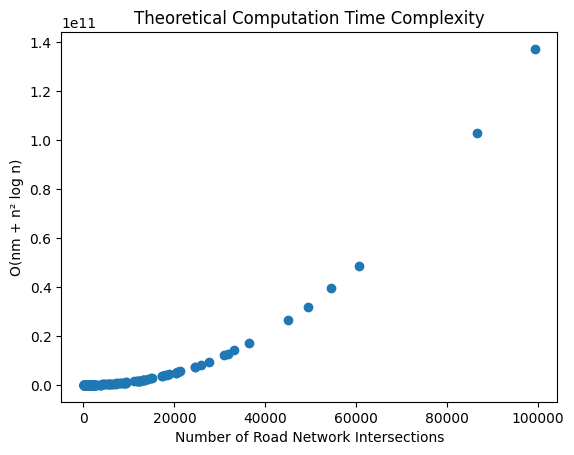
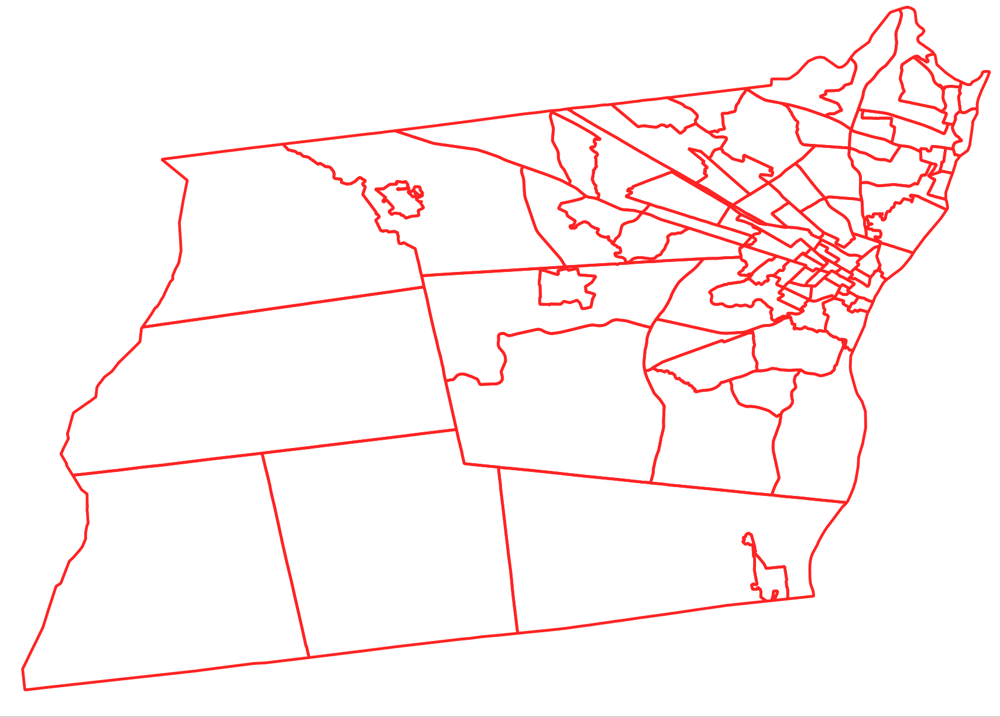
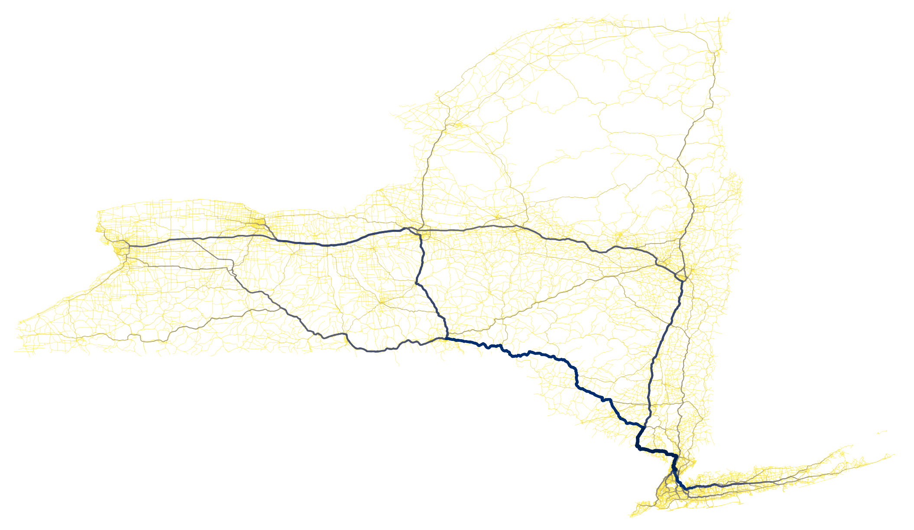

# NetworkX Edge Betweenness Centrality (NYSDOT Region 1)

## Edge Betweenness Centrality Computational Complexity

The computation time for betweenness centrality does not scale linearly with the road network size. The [computational complexity](https://en.wikipedia.org/wiki/Time_complexity) of this metric is `O(nm + n² log n)` where `n` is the number of nodes and `m` is the number of edges.

Roughly speaking, doubling the size of a network quadruples compututation time, and increasing the network size by a factor of ten consequentially increases run time by at least a factor of a hundred.

### Observed Computation Times vs Theoretical Time Complexity:

(Note: The road network with observed computation time of 50 hours was Erie County).

Resources:

- [NetworkX Edge Betweenness Centrality](https://networkx.org/documentation/stable/reference/algorithms/generated/networkx.algorithms.centrality.edge_betweenness_centrality.html#rc3df3f41cd0d-1)
- A Faster Algorithm for Betweenness Centrality. Ulrik Brandes, Journal of Mathematical Sociology 25(2):163-177, 2001. https://doi.org/10.1080/0022250X.2001.9990249

### Problems with divide and conquer road network partitioning

Computing betweenness centrality at scale presents the challenge that partitioning the network to run the measure on manageably sized subnetworks dramatically affects the results. Intuitively, road network partitions essentially introduce impassable artificial barriers, in effect turning all roads at partition boundaries into dead ends.

Therefore, any divide and conquer strategy employed to reduce the betweenness centrality metric's computational cost must consider the severe distortive effects of partitioning the network prior to computation.

A viable option for reducing the network work size for large areas is to drop lower level roads. For example, dropping all residential and service roads reduces the state-wide network's size enough to make computation faster than computing the metric for all roads within some larger counties.

It is worth mentioning that, when comparing edge betweenness centrality to AADT, it becomes evident that betweenness centrality metric computed using speedlimits alone is not an adequate proxy for actual road network use even when betweenness centrality is computed for the state-wide network.

The following visualizations show the effect of partitioning the road network to reduce betweenness centrality metric computation costs.

### Albany County

#### Tract Level Edge Betweenness Centrality

##### Census Tracts (Albany County)

##### Betweenness Centrality (Albany County, Census Tract Level)

---

#### County Subdivision Level Edge Betweenness Centrality

##### County Subdivisions (Albany County)

##### Betweenness Centrality (Albany County, County Subdivision Level)

#### County Level Edge Betweenness Centrality

##### Betweenness Centrality (Albany County, County Level)

##### NYSDOT RIS AADT (Albany County)

---

### NYSDOT Region 1

#### County Subdivision Level Edge Betweenness Centrality

##### County Subdivisions (NYSDOT Region 1)

##### Betweenness Centrality (NYSDOT Region 1, County Subdivision Level)

#### County Level Edge Betweenness Centrality

##### Counties (NYSDOT Region 1)

##### Betweenness Centrality (NYSDOT Region 1, County Level)

##### NYSDOT RIS AADT (NYSDOT Region 1)

---

### NYS

#### State Level Edge Betweenness Centrality (Interstates through Tertiary Roads ONLY)

##### NYSDOT RIS AADT (NYS)

### US Northeast (CT, MA, ME, NH, NJ, NY, PA, RI;)

####  Interstates through Primary Roads ONLY

####  Interstates through Secondary Roads ONLY

